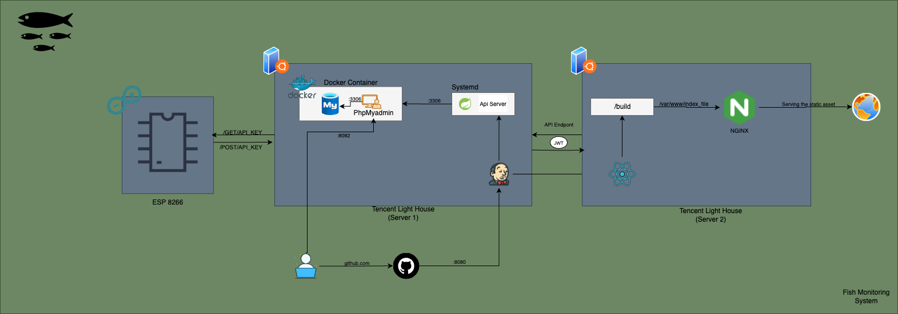

# Fish Monitoring API Documentation

## Base URL
```
http://localhost:8089/api
```

## Authentication
API menggunakan JWT (JSON Web Token) untuk autentikasi. Setelah login, sertakan token dalam header:
```
Authorization: Bearer <your_jwt_token>
```

---

## 1. Authentication Endpoints 

### 1.1 Register User
**POST** `/auth/register`

Mendaftarkan user baru ke sistem.

**Request Body:**
```json
{
  "username": "string",
  "password": "string"
}
```

**Response:**
```json
{
  "status": "201 CREATED",
  "message": "Registrasi berhasil",
  "payload": {
    "id": 1,
    "username": "john_doe",
    "password": "$2a$10$..." // encrypted password
  }
}
```

### 1.2 Login User
**POST** `/auth/login`

Login user dan mendapatkan JWT token.

**Request Body:**
```json
{
  "username": "string",
  "password": "string"
}
```

**Response:**
```json
{
  "status": "200 OK",
  "message": "Login berhasil",
  "payload": {
    "token": "eyJhbGciOiJIUzUxMiJ9...",
    "id": "1",
    "username": "john_doe"
  }
}
```

---

## 2. Monitoring Endpoints

### 2.1 Welcome Message
**GET** `/monitoring/welcome`

Endpoint publik untuk testing koneksi.

**Response:**
```
Welcome Developers
```

### 2.2 Get All Sensor Data
**GET** `/monitoring/sensors`

🔒 **Requires Authentication**

Mengambil semua data sensor berdasarkan kode dan ID user.

**Query Parameters:**
- `code` (string, required): Kode perangkat
- `id` (string, required): ID user

**Response:**
```json
{
  "status": "200 OK",
  "message": "Data sensors",
  "payload": [
    {
      "id": 1,
      "timestamp": "2025-01-30T10:30:00",
      "pvVoltage": 12.5,
      "pvCurrent": 2.3,
      "pvPower": 28.75,
      "battVoltage": 12.1,
      "battChCurrent": 1.5,
      "battChPower": 18.15,
      "loadCurrent": 0.8,
      "loadPower": 9.68,
      "battPercentage": 85.0,
      "battTemp": 25.5,
      "battDischCurrent": 0.0,
      "envTemp": 28.2,
      "phBioflok": 7.2,
      "tempBioflok": 26.8,
      "doBioflok": 6.5,
      "code": "DEVICE001",
      "iduser": "1"
    }
  ]
}
```

### 2.3 Get Latest Sensor Data
**GET** `/monitoring/sensors/latest`

🔒 **Requires Authentication**

Mengambil data sensor terbaru berdasarkan kode dan ID user.

**Query Parameters:**
- `code` (string, required): Kode perangkat
- `id` (string, required): ID user

**Response:** (sama dengan Get All Sensor Data, tapi hanya 1 record terbaru)

### 2.4 Save Sensor Data (Microcontroller)
**POST** `/monitoring/micro/sensors`

Endpoint khusus untuk microcontroller mengirim data sensor.

**Request Body:**
```json
{
  "timestamp": "2025-01-30T10:30:00",
  "pvVoltage": 12.5,
  "pvCurrent": 2.3,
  "pvPower": 28.75,
  "battVoltage": 12.1,
  "battChCurrent": 1.5,
  "battChPower": 18.15,
  "loadCurrent": 0.8,
  "loadPower": 9.68,
  "battPercentage": 85.0,
  "battTemp": 25.5,
  "battDischCurrent": 0.0,
  "envTemp": 28.2,
  "phBioflok": 7.2,
  "tempBioflok": 26.8,
  "doBioflok": 6.5,
  "code": "DEVICE001",
  "iduser": "1"
}
```

**Response:**
```json
{
  "status": "success",
  "message": "Data berhasil disimpan",
  "payload": {
    // same as request body without id field
  }
}
```

---

## 3. Relay Control Endpoints

### 3.1 Get All Relays
**GET** `/control/relay/all`

🔒 **Requires Authentication**

Mengambil semua relay berdasarkan ID user.

**Query Parameters:**
- `id` (string, required): ID user

**Response:**
```json
{
  "status": "200 OK",
  "message": "Relay List",
  "payload": [
    {
      "id": 1,
      "val": true,
      "code": "RELAY001",
      "iduser": "1"
    }
  ]
}
```

### 3.2 Get Relay by Code (Microcontroller)
**GET** `/control/micro/getByCode`

Endpoint khusus untuk microcontroller mengambil status relay.

**Query Parameters:**
- `code` (string, required): Kode relay
- `iduser` (string, required): ID user

**Response:**
```json
{
  "status": "200 OK",
  "message": "Relay found",
  "payload": {
    "id": 1,
    "val": true,
    "code": "RELAY001",
    "iduser": "1"
  }
}
```

### 3.3 Save Relay
**POST** `/control/save`

🔒 **Requires Authentication**

Menyimpan relay baru.

**Request Body:**
```json
{
  "val": false,
  "code": "RELAY001",
  "iduser": "1"
}
```

**Response:**
```json
{
  "status": "201 CREATED",
  "message": "Relay saved successfully",
  "payload": {
    "id": 1,
    "val": false,
    "code": "RELAY001",
    "iduser": "1"
  }
}
```

### 3.4 Update Relay Value
**PUT** `/control/updateValByCode`

🔒 **Requires Authentication**

Mengupdate nilai relay (ON/OFF).

**Query Parameters:**
- `code` (string, required): Kode relay
- `val` (boolean, required): Status relay (true/false)
- `id` (string, required): ID user

**Response:**
```json
{
  "status": "200 OK",
  "message": "Relay value updated successfully",
  "payload": {
    "val": "ON" // or "OFF"
  }
}
```

---

## 4. Kolam (Pool) Management Endpoints

### 4.1 Add Kolam
**POST** `/kolam/add`

🔒 **Requires Authentication**

Menambahkan kolam baru.

**Request Body:**
```json
{
  "name": "Kolam Lele 1",
  "code": "KOLAM001",
  "iduser": "1",
  "status": true
}
```

**Response:**
```json
{
  "status": "201 CREATED",
  "message": "Success",
  "payload": {
    "id": 1,
    "name": "Kolam Lele 1",
    "code": "KOLAM001",
    "iduser": "1",
    "status": true
  }
}
```

### 4.2 Get Kolam by Code
**GET** `/kolam/select`

🔒 **Requires Authentication**

Mengambil kolam berdasarkan kode dan ID user.

**Query Parameters:**
- `code` (string, required): Kode kolam
- `id` (string, required): ID user

**Response:**
```json
{
  "status": "200 OK",
  "message": "List Kolam",
  "payload": {
    "id": 1,
    "name": "Kolam Lele 1",
    "code": "KOLAM001",
    "iduser": "1",
    "status": true
  }
}
```

### 4.3 Get All Kolam
**GET** `/kolam/select/all`

🔒 **Requires Authentication**

Mengambil semua kolam berdasarkan ID user.

**Query Parameters:**
- `id` (string, required): ID user

**Response:**
```json
{
  "status": "200 OK",
  "message": "List Kolam",
  "payload": [
    {
      "id": 1,
      "name": "Kolam Lele 1",
      "code": "KOLAM001",
      "iduser": "1",
      "status": true
    }
  ]
}
```

### 4.4 Update Kolam Status
**PUT** `/kolam/updatestatus`

🔒 **Requires Authentication**

Mengupdate status kolam (active/inactive).

**Query Parameters:**
- `code` (string, required): Kode kolam
- `val` (boolean, required): Status kolam (true/false)
- `id` (string, required): ID user

**Response:**
```json
{
  "status": "200 OK",
  "message": "success",
  "payload": {
    "val": "Activate" // or "Deactivate"
  }
}
```

---

## 5. Schedule Management Endpoints

### 5.1 Save Schedule
**POST** `/schedule/save`

🔒 **Requires Authentication**

Menyimpan jadwal feeder.

**Request Body:**
```json
{
  "code": "FEEDER001",
  "iduser": "1",
  "schedule": "08:00,12:00,18:00"
}
```

**Response:**
```json
{
  "status": "201 CREATED",
  "message": "success",
  "payload": {
    "id": 1,
    "code": "FEEDER001",
    "iduser": "1",
    "schedule": "08:00,12:00,18:00"
  }
}
```

### 5.2 Get Schedule
**GET** `/schedule/getTime`

Mengambil jadwal berdasarkan kode dan ID user.

**Query Parameters:**
- `code` (string, required): Kode feeder
- `id` (string, required): ID user

**Response:**
```json
{
  "status": "200 OK",
  "message": "Success",
  "payload": {
    "id": 1,
    "code": "FEEDER001",
    "iduser": "1",
    "schedule": "08:00,12:00,18:00"
  }
}
```

---

## Error Responses

Semua endpoint dapat mengembalikan error response dengan format:

```json
{
  "status": "400 BAD_REQUEST", // or other HTTP status
  "message": "Error description",
  "payload": null
}
```

### Common Error Status Codes:
- `400 BAD_REQUEST`: Request tidak valid
- `401 UNAUTHORIZED`: Token tidak valid atau tidak ada
- `404 NOT_FOUND`: Resource tidak ditemukan
- `500 INTERNAL_SERVER_ERROR`: Error server

---

## CORS Configuration

API mendukung CORS untuk origin berikut:
- `http://localhost:5173`
- `http://127.0.0.1:5173`
- `http://43.165.196.6`
- `https://43.165.196.6`
- `http://monitoring.infarm.web.id`
- `https://monitoring.infarm.web.id`

---

## Notes

1. **Authentication**: Sebagian besar endpoint memerlukan JWT token kecuali yang ditandai sebagai public
2. **Microcontroller Endpoints**: Beberapa endpoint khusus dirancang untuk komunikasi dengan microcontroller
3. **Database**: Menggunakan MySQL dengan auto-update schema
4. **Security**: Password dienkripsi menggunakan BCrypt
5. **CORS**: Dikonfigurasi untuk mendukung frontend dari berbagai domain